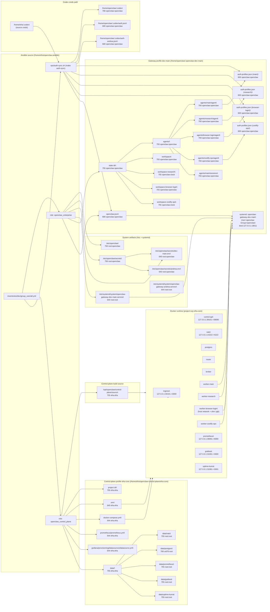
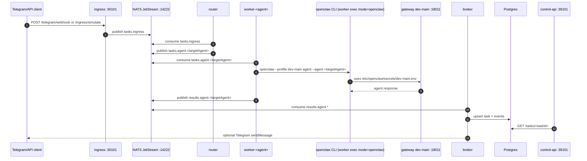
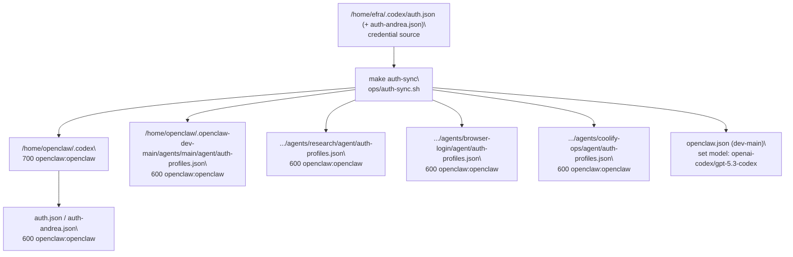

# Installed Runtime Layout (dev-main + efra-core)

This document describes how Ansible leaves the system installed for:

- Gateway enterprise profile: `dev-main`
- Control-plane profile (full mode): `efra-core`

## 1) Disk Layout + Permissions (Detailed)

## 2) Runtime Message Flow (full efra-core)

## 3) Auth Sync Flow (non-interactive)

## 4) Quick Permission Matrix (critical paths)

| Path | Mode | Owner:Group | Purpose |
|---|---:|---|---|
| `/etc/openclaw` | `750` | `root:openclaw` | OpenClaw system config root |
| `/etc/openclaw/secrets` | `750` | `root:openclaw` | per-profile env secrets |
| `/etc/openclaw/secrets/dev-main.env` | `640` | `root:openclaw` | gateway/profile runtime secrets |
| `/etc/systemd/system/openclaw-gateway-dev-main.service` | `644` | `root:root` | gateway unit |
| `/home/openclaw/.openclaw-dev-main` | `755` | `openclaw:openclaw` | profile state root |
| `/home/openclaw/.openclaw-dev-main/openclaw.json` | `600` | `openclaw:openclaw` | profile config |
| `/home/openclaw/.openclaw-dev-main/agents/*/agent` | `700` | `openclaw:openclaw` | per-agent private state |
| `/home/openclaw/.openclaw-dev-main/agents/*/agent/auth-profiles.json` | `600` | `openclaw:openclaw` | provider auth store |
| `/home/openclaw/.codex` | `700` | `openclaw:openclaw` | local codex credential mirror |
| `/home/openclaw/.codex/auth*.json` | `600` | `openclaw:openclaw` | codex oauth tokens |
| `/home/efra/openclaw-control-plane/efra-core/.env` | `640` | `efra:efra` | compose secrets/env |
| `/home/efra/openclaw-control-plane/efra-core/data/postgres` | `700` | `uid70:root` | postgres persistent volume |
| `/opt/openclaw/control-plane/source` | `755` | `efra:efra` | service build source synced by ansible |

